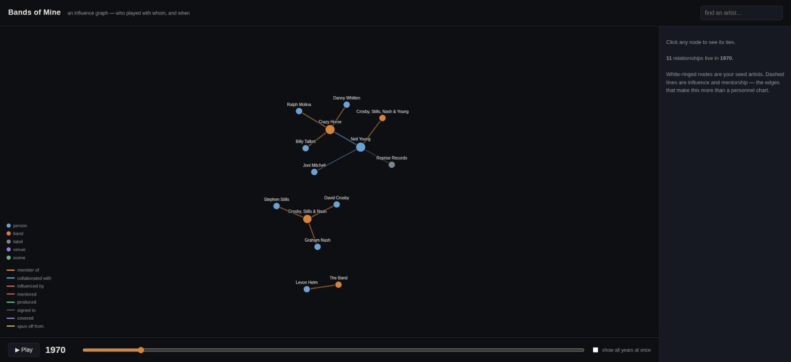

# Bands of Mine

An **influence graph** for the music I love — folk, bluegrass, rock & roll, and the
tangle of bands, players, and mentors that connect them. It starts from *my* artists
(the "seeds") and grows outward along the ties that actually shaped the sound: who was
in what band, who produced whom, who covered whom, who lit the fuse for whom.

It is a **social-network analysis where the edges carry time.** Drag the year slider and
watch Neil Young's world bloom in 1969–71 as Buffalo Springfield, Crazy Horse, and CSNY
all overlap — then watch it thin out and re-form across five decades. That temporal
dimension is the whole point: influence isn't a static map, it's a *history*.



## The idea

> "Heart of Gold put me in the middle of the road. Traveling there soon became a bore
> so I headed for the ditch." — Neil Young

Neil Young is the seed of this whole project because nobody personifies musical
resilience better — the willingness to shed a sound the moment it becomes comfortable,
to alienate an audience in service of the muse, and to keep being *vital* for fifty years.
The bio that kicked this off traces that swerve from Buffalo Springfield → the ditch →
grunge godfather → Rick Rubin analog tape. From there the graph reaches Bob Dylan, The
Band, Willie Nelson, Joni Mitchell, and outward.

## How it works

```
data/raw/bios/*.txt     copyrighted source text — LOCAL CACHE, gitignored, never committed
        │
        │  (you + Claude read these)
        ▼
data/graph/nodes.json   artists, bands, labels — the FACTS (committed)
data/graph/edges.json   temporal, sourced relationships — the FACTS (committed)
        │
        ▼
index.html              a D3 force-directed, time-scrubbing visualization (no build step)
```

**Only facts live in git.** The raw bios are AllMusic/Rovi/Wikipedia text — copyrighted,
so they stay in a local reading cache (`data/raw/`, gitignored). Names, dates, and
relationships aren't copyrightable, so the extracted graph is committed and the whole
thing stays shareable. Every node and edge records its `sources`, so you can always ask
"where did that claim come from?"

See [`SCHEMA.md`](SCHEMA.md) for the data model and [`docs/ADDING_ARTISTS.md`](docs/ADDING_ARTISTS.md)
for how to grow the graph.

## Run it

No build step — it's plain HTML + D3 from a CDN. Any static server works:

```bash
python3 -m http.server 8765
# then open http://127.0.0.1:8765/index.html
```

(You need a server rather than opening the file directly because it `fetch()`es the JSON.)

## Grow the graph

```bash
# Validate before every commit — a graph that lies to you is worse than none.
python3 scripts/validate_graph.py

# Enrich from MusicBrainz (CC0, models band membership with dates). Dry-run by default.
python3 scripts/fetch_musicbrainz.py --expand-seeds          # preview additions
python3 scripts/fetch_musicbrainz.py --expand-seeds --write  # apply, then re-validate
```

## Edge types — what makes it *influence*

`member_of` and `collaborated_with` are the skeleton. But the edges that make this an
*influence* diagram rather than a personnel chart are the dashed ones: **`influenced_by`**
and **`mentored`** — Young as Godfather of Grunge to Pearl Jam, Young hiring Sonic Youth
to open and absorbing their noise in return. Those are the hardest to source and the most
valuable to get right.

## Status

Seeded with the Neil Young bio (40 nodes, 48 edges). Next: Bob Dylan, The Band, Willie
Nelson, Joni Mitchell — the seeds already planted in the graph, waiting for their own bios.
